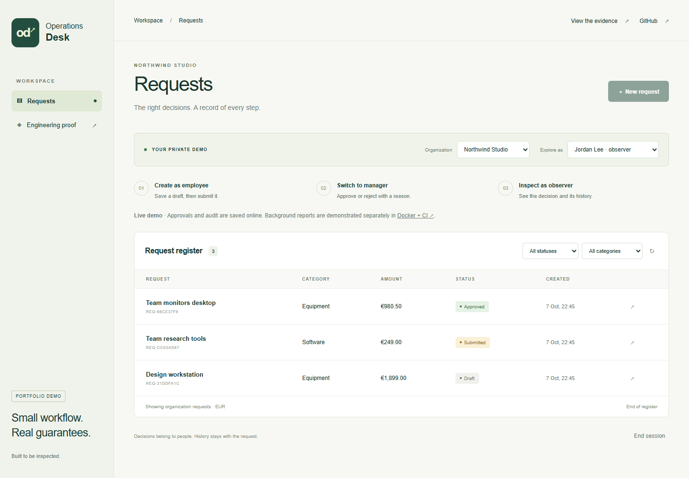
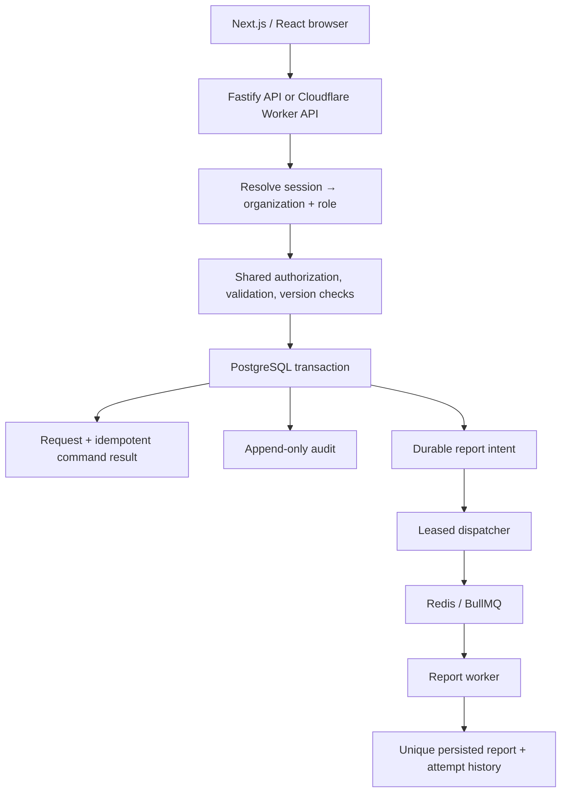

# Operations Desk

[Live demo](https://operations-desk-reliability.vanya-matyushkin.workers.dev) · [Engineering evidence](https://operations-desk-reliability.vanya-matyushkin.workers.dev/proof/) · [GitHub Actions](https://github.com/Hadezu/operations-desk-reliability/actions)

[](https://github.com/Hadezu/operations-desk-reliability/actions/workflows/verify.yml)

Multi-tenant approvals with Next.js, Node.js/Fastify, PostgreSQL/Prisma and Redis/BullMQ. Create a request, submit it, approve it as a manager, and inspect the audit trail as an observer.

The interesting part is what happens when two decisions collide, a command is repeated, or a worker dies after committing its result.

**Execution evidence:** [machine-readable verification manifest](evidence/manifest.json). The application’s `/proof/` page displays this artifact, including environment, timestamp, commit and a hash of the tested source. Local results are labelled local. A GitHub Actions link appears only after a real run.

**Verified release:** [results and deployment provenance](docs/RELEASE.md), including the successful integration/container CI run and the separate public deployment observations.

**Try it in two minutes:** open the live demo and select **Try the demo**. Create and submit a request as Alex, approve it as Sam, then inspect the activity as Jordan. Each visitor receives a separate workspace. No account, installation or personal data is needed. The app runs on Cloudflare Workers Free with Neon Free PostgreSQL; it does not depend on a developer laptop. This is an original synthetic portfolio application, not a customer implementation.

The verification workflow runs 40 API/database assertions across the Prisma and edge SQL adapters, five worker-recovery scenarios, desktop/mobile browser journeys, a Cloudflare runtime check and a separate Docker Compose job. See the exact tested revision and observed results in the evidence artifact; the badge shows the latest workflow status.



## What can be checked

| Claim | Executable proof | Expected observation |
|---|---|---|
| Tenant isolation | [API tests](tests/api.test.ts), `TENANT` cases | Foreign read/edit/delete/audit rejected; original row unchanged |
| Server authorization | Same file, `RBAC` cases | Employee approval and observer writes return 403; manager cannot self-approve |
| Opaque sessions and CSRF | Same file, `SESSION` / `CSRF` | Hashed server token, expiry/revocation, rejected foreign-origin mutations |
| Command idempotency | Same file, `IDEMPOTENCY` | Concurrent repeated command produces one request and one audit entry; changed payload returns 409 |
| Concurrent decisions | Same file, `CONCURRENCY` | One decision succeeds; competing writer gets 409 |
| Transactional outbox | Same file, `OUTBOX` | Forced database failure rolls back decision and audit |
| Database guarantees | Same file, `DATABASE` / `AUDIT` / `RETENTION` | Composite tenant FKs, required decision comment, denied audit mutation, bounded expiry cleanup |
| Worker recovery | [Recovery suite](tests/worker-recovery.ts) | OS-killed worker restarts; one persisted report; interrupted attempt retained |
| Crash after commit | Same recovery suite | Saved report survives missing queue acknowledgement without a second result |
| Failed-job replay | Same recovery suite | Three attempts with exponential backoff; observer denied; manager replay audited |
| Lost queue record | Same recovery suite | Durable outbox intent republished after queue record removal |
| Usable workflow | [Browser journey](tests/browser/journey.spec.ts) | Desktop/mobile create → submit → approve → audit; tenant switch and reload |

## Try the full environment

Requires Docker with Compose. Ports bind to loopback; the credentials below are public **local demo credentials**.

```sh
docker compose up --build --wait
```

Open **http://localhost:3100** and select **Try the demo**. Migrations and the restricted database role are provisioned automatically. Each visitor gets a separate workspace; no shared account credentials are needed.

1. Alex / employee: create a request and submit it.
2. Sam / manager: open it and approve with a comment.
3. Jordan / observer: inspect the decision and activity history.
4. Switch organization: the previous organization’s request disappears.

For automated verification, install Node.js 24 and run:

```sh
npm ci
cp .env.example .env
npx playwright install chromium
npm run verify
```

`verify` runs type checks, real-database API tests, a separate clean recovery database, actual worker termination/restart, the Next.js production build, browser tests, and Cloudflare’s deployment dry run. It fails on failed checks and writes the results to `evidence/manifest.json`. The recovery test account needs permission to create its own temporary database; the application process does not receive that account.

For container browser evidence, run `E2E_BASE_URL=http://localhost:3100 EXPECT_REPORT=1 npm run test:e2e`. This additionally waits for a report from the actual Compose worker. The CI container job runs this check. GitHub uses Chrome already installed in its [Ubuntu 24.04 runner image](https://github.com/actions/runner-images/blob/main/images/ubuntu/Ubuntu2404-Readme.md), and records its version; local verification defaults to Playwright Chromium unless `PLAYWRIGHT_CHANNEL=chrome` is set.

## Develop without Docker

```sh
npm ci
npm run db:generate
npm run db:local
# Keep PostgreSQL running; in another terminal:
npm run dev
```

The optional local helper runs real PostgreSQL 18 on `127.0.0.1:55432`, applies migrations, and writes an ignored `.env` if absent. It uses the `embedded-postgres` package’s native database binaries; it is not an in-memory substitute. Default local mode disables background reports explicitly. To run the full recovery tests, supply a real Redis endpoint in `REDIS_URL` and run `npm run test:recovery`.

The Windows verification environment used the community [Redis Windows build](https://github.com/redis-windows/redis-windows/releases/tag/8.10.2), with the published SHA-256 checked before execution. Linux CI/Compose uses the official Redis container. These environments are identified separately; a Windows run does not stand in for a Docker run.

## Architecture and trust boundaries



The online deployment uses a **Next.js static export**, a Cloudflare Worker API and Neon PostgreSQL over HTTPS. The full environment uses the same business operations through a standalone Fastify server and a BullMQ worker. Node uses Prisma ORM. The edge API uses a bounded, parameterized SQL adapter. Production sends its queries over Neon HTTPS; local Cloudflare tests use Postgres.js/TCP through Hyperdrive. The shared query adapter and Prisma execute the same authorization and transaction assertions; the real HTTPS transport is checked by the public smoke and browser journeys. Shared session joins and atomic demo provisioning minimize database round trips. A PostgreSQL function applies each command, audit and optional outbox intent in one round trip under the caller’s restricted privileges. The public approval flow has `backgroundMode=disabled`; it does not create work that waits forever for an absent worker. The UI points to the worker evidence instead.

Next.js App Router, React, TypeScript, forms, API integration, loading/error states and browser tests are demonstrated. SSR, Server Actions and a live hosted Redis worker are not claimed.

## Application rules versus database guarantees

| Application | PostgreSQL |
|---|---|
| Resolve tenant from session; scope every request read/write | Composite organization/owner and organization/request foreign keys |
| Employee own records; manager/observer organization reads | Valid roles/statuses/categories; amount/version checks |
| Own-draft edits and submission; manager decisions on others | Conditional version update arbitrates concurrent writers |
| Same-origin mutation, CSRF token, schema validation | Command key uniqueness scoped by tenant, actor, operation |
| Fingerprint prevents reusing a command key for different input | Decision, audit, command result and report intent commit atomically |
| Reports only enabled with an actual worker | Unique outbox/request report relationships |
| No audit edit endpoint | Runtime role denied UPDATE/DELETE/TRUNCATE on audit |

Tenant isolation is enforced in the application with relational constraints; **PostgreSQL RLS is not implemented**. The database owner can perform migrations and maintenance. A bounded `SECURITY DEFINER` function removes only expired demo workspaces after seven days. It has a fixed search path and no arguments; the runtime role cannot change workspace expiry to evade audit retention.

Demo switching is a capability inside an isolated visitor workspace. It changes the server-side session and rotates CSRF. It is deliberately not a production login, password reset or OIDC integration.

## Delivery and recovery semantics

- `Idempotency-Key` is mandatory on create/edit/submit/decision. Same key and normalized payload returns the stored response, including after the request has advanced to a later state.
- The atomic command function uses PostgreSQL uniqueness to arbitrate duplicate commands and conditional updates to reject stale versions. It is `SECURITY INVOKER`; the same database function is used by Node and Cloudflare.
- The outbox dispatcher leases rows with `FOR UPDATE SKIP LOCKED`. A crash after publish leaves a lease that can be reclaimed. The deterministic queue ID includes a replay generation.
- BullMQ attempts three times with exponential backoff. A terminal failure remains in the failed queue and the database. Only a manager can replay a failed event, with a reason; a new generation is audited.
- The worker commits report + completion audit + outbox state together. A duplicate job reuses the persisted report. Missing queue records are reconciled from the outbox.
- A unique report constraint is the final guard. The claim is **idempotent processing with one persisted result under the tested retry scenarios**, not universal exactly-once delivery.
- `TEST_FAULT` injection is effective only when `NODE_ENV=test`. Tests exercise poison jobs, hanging workers and exit immediately after database commit.

JSON logs carry `request_id`, organization, job and attempt identifiers. The correlation ID is generated by the server and carried from the approval through the outbox to the report. Bodies, cookies, credentials and database exception messages are not logged. Attempt and audit history are also visible in the request detail screen.

## API and evidence

`packages/contracts` contains the Zod input/output/error schemas and the generated [command OpenAPI document](docs/openapi.json). `GET /api/openapi.json` returns the same contract. The current OpenAPI scope is the four idempotent commands; read/session/report routes are listed in [API notes](docs/API.md).

Evidence is regenerated by executing commands, not manually setting pass flags. Each result includes expected behavior, observed result, source and duration. A source fingerprint prevents an ordinary new build from reusing evidence for different code. CI uploads raw results and Playwright traces on failure. This repository is published independently; the checked-in workflow runs against its root. The final CI job merges evidence only after both integration and container jobs succeed. Public deployment observations are collected separately by `scripts/record-deployment.ts`, including the sampled Worker version and CPU distribution.

## Cost and deployment

See [deployment gates and current free-tier sources](docs/DEPLOYMENT.md). No paid plan, paid container, domain purchase or external messaging service is required for development. The deployed configuration uses verified Free accounts, a restricted PostgreSQL role and a stateless HTTPS database connection. No paid subscription or keep-alive service was enabled.

Free quotas cannot promise uninterrupted service. Static `/proof/` remains independently accessible if the API quota is exhausted. API rate limits, daily demo admission and seven-day retention bound normal demo growth; they do not turn a free tier into an SLA.

The separate contribution to an existing Next.js OSS codebase is tracked in [accepted scope](docs/SCOPE.md) and starts after this application. No OSS contribution is claimed by this original codebase.
